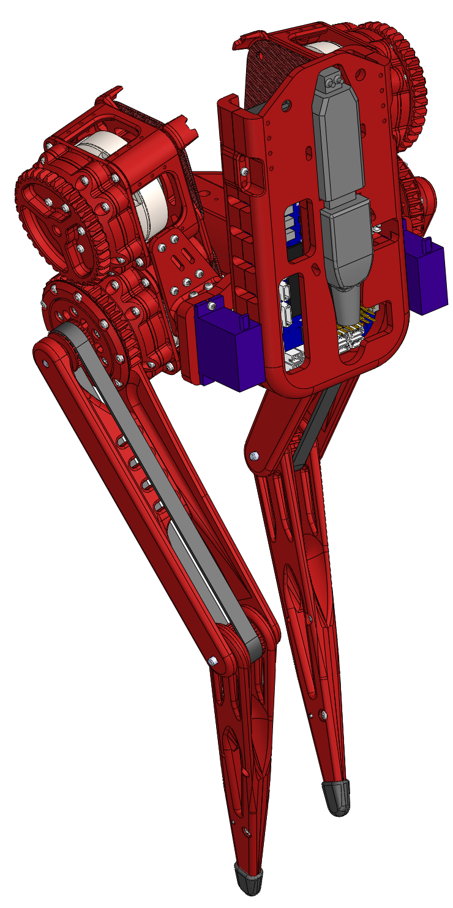
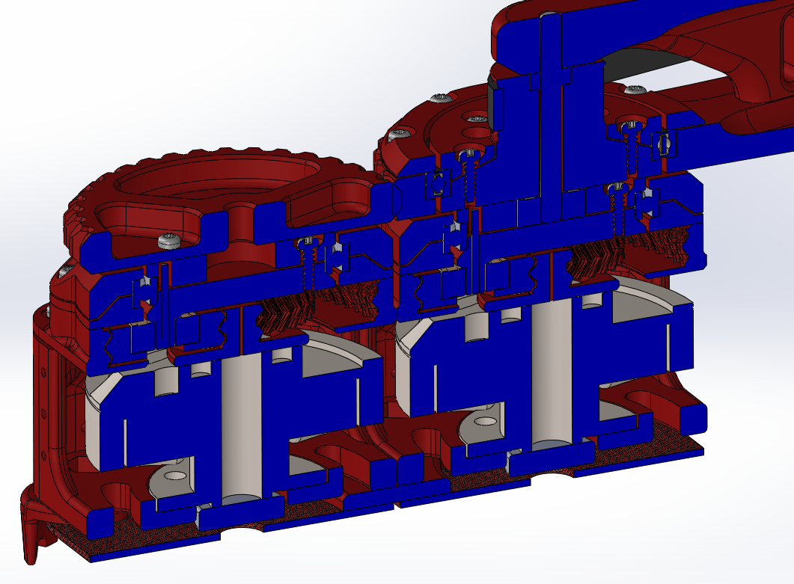

# TipTap
A 3d-printed bipedal robot. A low-cost desktop option for semi-direct drive walking research.

## Software
* Coming soon!

## Component
Please let me know if you find these directions difficult or find mistakes, thank you!

### Manufactured Components
* Qty 4. TipTap Motors: https://github.com/DarrenLevine/TipTapMotor

### Printed Components
Note: I used the LulzbotMini_TipTap.curaprofile on my lulzbot mini to print all of the parts in esun PLA+.
* Qty 1. BeagleBoneBlue_CaseW_RS485USB-Inner.STL
* Qty 1. BeagleBoneBlue_CaseW_RS485USB-Outer.STL
* Qty 2. DualMotorPCBspacer.STL
* Qty 2. HipPulleyHub-Gear.STL
* Qty 2. HipPulleyHub-PressurePlate.STL
* Qty 4. LowerLeg.STL
* Qty 1. PelvisBracket.STL
* Qty 1. PelvisBracketForServos_WBuckConv.STL
* Qty 2. SwivelPlate.STL
* Qty 2. SwivelPlateMirror.STL
* Qty 2. SwivelPlateServoMount.STL
* Qty 2. SwivelPlateServoMountMirror.STL
* Qty 2. UpperLegGeared-Leg.STL
* Qty 2. UpperLegGeared-PressurePlate.STL
* Qty 2. UpperLegHubGear.STL
* Qty 2. UpperLegOuter.STL

### Purchased Components
* Qty 4. 623ZZ 3mm x 10mm x 4mm Shielded Deep Groove Precision Ball Bearing
* Qty 6. MR63ZZ L-630 673ZZ Ball Bearings
* Qty 2. AST 6706-2RS Thin Section Bearing
* Qty 2. MG92B servos
* Qty 2. BESTORQ 300-3M-6 3M Timing Belt
* Qty 1. BeagleBone Blue (BBB)
* Qty 1. LM2596 Buck Converter (set to output ~7.4v for the BBB)
* Qty 1. Mini Micro ZH 1.5 3-Pin JST Connector (to connect LM2596 to BBB)
* Qty 1. JBtek USB to RS485 Converter Adapter ch340T
* Qty 1. UCEC Short SuperSpeed USB 3.0 Extension Cable - Left/Right angle
* Qty 4. uxcell 304 Stainless Steel Dowel Pin 3mmx30mm
* Qty 2. uxcell 304 Stainless Steel Dowel Pin 3mmx10mm
* Qty 2. Rubber vacuum cap 1/4" Tube OD, 1-1/4" Long
* Qty 4. M3x8mm Nylon bolt and nut
* Qty ~200. 96817A156 Thread Forming Screw for Thin Plastic
* Qty ~6. Mini zip ties
* Qty ~. Your preference for connectors and wires, I used 7 XT30U connectors with 18AWG silicon wires for power

### Recommended Support Components:
* ~24V Power: A benchtop power supply, lipos, or a 24V ~10A power adapter.
* A soldering station, some spare silicon wire, wire cutters, strippers, and snips
* A T6 torx screwdriver for the 96817A156 screws
* A phillips screwdriver for the nylon bolts
* Superglue or epoxy to fix the knee joint 3mmx30mm pins in place

## Pictures / Assembly References

